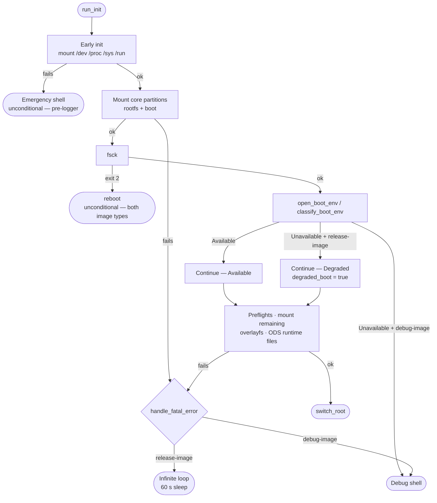

# Error Handling Overview

This document describes every failure point in the initramfs boot sequence
and the resulting behaviour per image type.

## Image types

| Image type | Feature flag | Fatal error behaviour |
|---|---|---|
| Release | `release-image` | Infinite loop (60 s sleep), logs `FATAL` — prevents reboot loops |
| Debug | _(absent)_ | Debug shell (`/bin/bash`, fallback `/bin/sh`), respawns on exit |

Both image types share the same error path in `main.rs::handle_fatal_error`,
with two unconditional special cases that ignore the image type (see notes below).

---

## Boot sequence error flow



---

## Failure points

| Stage | Failure | Error type | Release-image | Debug-image |
|---|---|---|---|---|
| Mount `/dev`, `/proc`, `/sys`, `/run` | mount(2) fails | `EarlyInitError` | emergency shell ¹ | emergency shell ¹ |
| Logger init | `/dev/kmsg` unavailable | `Io` | infinite loop | debug shell |
| Config load | `/proc/cmdline` unreadable | `ConfigError` | infinite loop | debug shell |
| Root device detection | device or symlink missing | `PartitionError` | infinite loop | debug shell |
| Partition layout / symlinks | invalid partition table | `PartitionError` | infinite loop | debug shell |
| Mount rootfs / boot | mount(2) fails | `FilesystemError` | infinite loop | debug shell |
| fsck on boot partition | exit code 2 (reboot required) | `FsckRequiresReboot` | **reboot** ² | **reboot** ² |
| Bootloader env unavailable | `open_boot_env()` fails | `DegradedBoot` | **continues** ³ | debug shell |
| Preflight / resize-data | resize or fsck fails | `ResizeDataError` | infinite loop | debug shell |
| Mount remaining partitions | factory / cert / etc / data | `FilesystemError` | infinite loop | debug shell |
| Overlayfs setup / fs links | overlayfs or symlink fails | `FilesystemError` / `Io` | infinite loop | debug shell |
| ODS runtime file creation | write to `/run` fails | `Io` | infinite loop | debug shell |
| `switch_root` | init not found, MS_MOVE, or exec fails | `Io` | infinite loop | debug shell |

---

## Notes

**¹ Emergency shell** — fires before the kmsg logger is initialised.
Uses `eprintln!` directly and spawns `/bin/sh`. No release/debug distinction
at this point because the image-type flag is not yet evaluated.

**² `FsckRequiresReboot`** — special-cased _before_ the release/debug split in
`handle_fatal_error`. Always triggers `reboot(2)` on both image types. The fsck
diagnostic is persisted to the bootloader environment (grubenv / uboot-env)
before the reboot so it survives across the boundary.

Bootloader-specific note: on GRUB the boot partition is unmounted when fsck
runs, so `open_boot_env()` fails and the env is `Degraded` — the persist
is a no-op (no env to write to). On uboot `UBootBootEnv::new()` is
infallible (env accessed lazily via `fw_setenv`/`/etc/fw_env.config`), so the
env is `Available` and the diagnostic is successfully saved before reboot.
`apply_boot_env_decision` in `run_init` owns this contract.

**³ Degraded boot (release-image only)** — when `open_boot_env()` fails
on a release image, the boot sequence continues. The flag `degraded_boot: true`
is written to `/run/omnect-device-service/omnect-os-initramfs.json` so
`omnect-device-service` can act on the degraded state at runtime. On a debug
image the same failure immediately enters the debug shell.

---

## Error type hierarchy

```
InitramfsError
├── EarlyInitError       — /dev, /proc, /sys, /run mount failures
├── ConfigError          — /proc/cmdline read failure
├── PartitionError       — device detection, partition table, symlinks
├── FilesystemError
│   ├── MountFailed      — mount(2) returned an error
│   ├── FsckFailed       — fsck exit ≥ 4 (corruption, not reboot)
│   ├── FsckRequiresReboot — fsck exit 2 (triggers unconditional reboot)
│   ├── OverlayFailed    — overlayfs setup error
│   └── FormatFailed     — mkfs failure
├── BootEnvError         — grub-editenv / fw_printenv command failures
├── DegradedBoot         — wraps BootEnvError; triggers degraded mode
├── ResizeDataError      — resize-data preflight failures (feature-gated)
├── LoggingError         — kmsg open / logger init failures
└── Io                   — uncategorised std::io::Error
```
